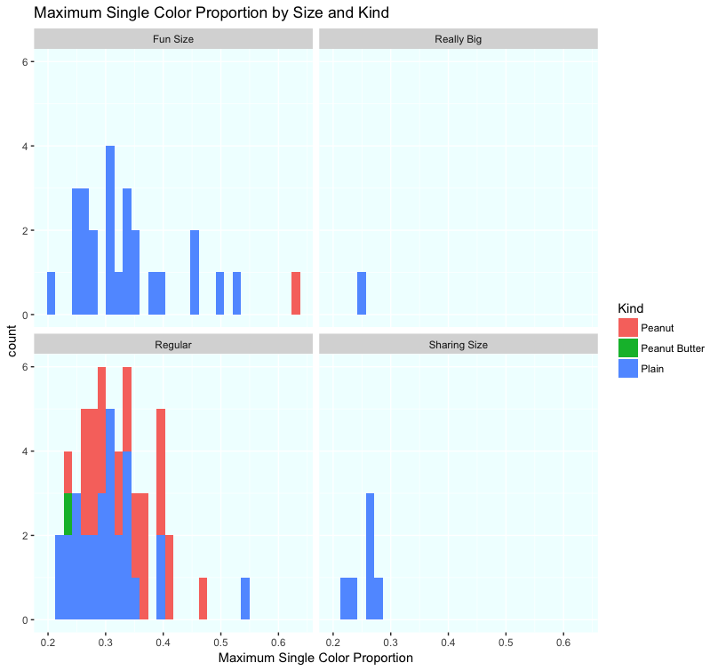
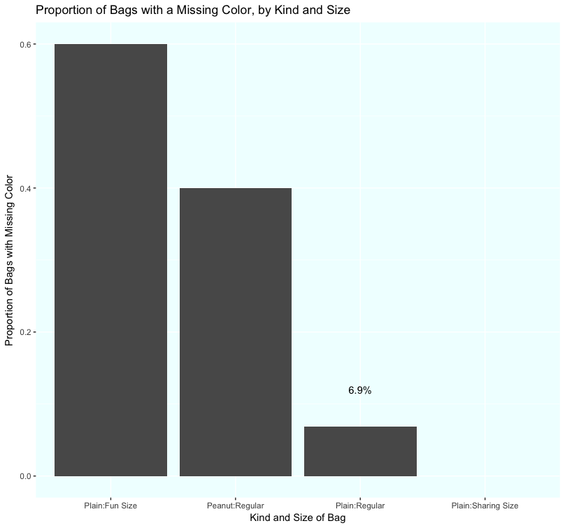

```{r setup, include=FALSE}
knitr::opts_chunk$set(echo = TRUE, warning=FALSE)
```

# Introduction

## M&Ms are colorful, fun and make for great data

I bet when you open a bag of M&Ms, you look at a few of them in your hand, admire the pretty color variation that exists, and just **eat them**. Yes, I used to do that, too. But in March, 2014, I spilled bag of M&Ms onto my desk and noticed something odd. I used a tool from my days as a Six Sigma Black Belt and created a Pareto Chart, and snapped this picture:


```{r, echo=FALSE}
```


Wait a minute! Only one brown? Why aren't they more even?

To make a long story short, I posted this on Facebook, and started routinely making "M&M Pareto Charts" and posting them to an album. A friend joined in and posted ones with Peanut M&Ms. As of today, we have logged ````r nrow(read.csv("M&M Pareto Counts.csv"))```` bags of M&Ms in this manner.

And recently, I compiled the posts into a data set. 

## M&Ms and the questions I might ask about colors

  
But back to the candy!

I became fascinated by what I was seeing because I saw so much variation. I mean, the naive person might just assume that every bag had (roughly) the same amount of each color. You could imagine a manufacturing process that did that, right? But could you imagine a manufacturing process that wasn't predictable in terms of the distribution of colors? That's what I was seeing!

As I looked at these pictures, I came to be curious about a number of things:

* how often is there only one of one color?
* how often does a bag have only five of the six colors?
* does blue really dominate the counts, as it seems to?
* how does the color distribution differ by size of bag?
    + are smaller bags more variable? 
    + are smaller bags more likely to have missing colors?
* do Peanut and Plain M&Ms have similar color distributions?


```{r, echo=FALSE, message=FALSE}
# load some libraries I will use
library(tidyverse)
library(ggplot2)
library(forcats)
library(dplyr)
library(tidyr)


```


```{r, echo=FALSE}
# import the data file
original_df <- read.csv("M&M Pareto Counts.csv")

# fix dates, make working df
df <- original_df 
df$Date <- as.Date(df$Date)


```


```{r, echo=FALSE}
library(tidyr)
# tidy the data, first setting rownames to a column as sort of a Bag ID, then 
# gather, settting the "key" to be the colors, the "value" being the count of each color in a given bag
# preserve the bag number, the date, the notes, the kind of M&Ms and the submitter since they are all attributes of the bag, not the M&M color  

df_tidy <- df %>% tibble::rownames_to_column("BagNum") %>% 
    gather(key= MMColor, value = CountInBag, -BagNum, -Date, -Notes, -Kind, -Submitter) %>%
  arrange(BagNum)


```


```{r, echo=FALSE}
# add bag count, so you can determine sizing ranges
df$BagCount <- rowSums(df[4:9])

```

```{r, echo=FALSE}
# add in the BagCount to the tidy version so that later, we can use it
df_tidy <- df %>% tibble::rownames_to_column("BagNum") %>% 
    gather(key= MMColor, value = CountInBag, -BagNum, -Date, -Notes, -Kind, -Submitter, -BagCount) %>%
  arrange(BagNum)
```


```{r, echo=FALSE}
# proportion of each color within bag
df$yellowp <- df$Yellow/df$BagCount
df$bluep <- df$Blue/df$BagCount
df$greenp <- df$Green/df$BagCount
df$brownp <- df$Brown/df$BagCount
df$orange <- df$Orange/df$BagCount
df$redp <- df$Red/df$BagCount


```


Now, let's get to analyzing this data!

# Data Analysis

## Bag Sizes

One thing that is clearly missing from the data collection is the **Bag Size.** 

<span style="color:#156803">*M&Ms come in different sizes. There's a pretty typical size (which I call **Regular**), and there's the size you most often see around Halloween (a small bag callled **Fun Size** -- I like to joke that it would be more fun if it were bigger).*</span>

```{r, echo=FALSE}
# Do as histogram - shows a first glance
ggplot(df, aes(x=BagCount)) +
  geom_histogram(bins=20) +
  theme(panel.background = element_rect(fill="azure")) +
  ggtitle("Histogram: Count of M&Ms in Bags") +
  xlab("Count of M&Ms in a bag")
```

This gives us a pretty good first glance at the counts of M&Ms in the bags in our data set. We see there are at least four sizes. After a lot of views of those distributions, I classified all the bags.

```{r, echo=FALSE}
# Peanut sizes
# fun size is less than 10 -- there was only one in the data set
# set break point between the ranges observed, essentially the max of one size averages to the min of the next size up
pfun <- (10+15)/2
# regular is 15-25

# peanut butter bag is regular sized

# Plain sizes
# set break point between the ranges observed
# 10-20 is fun size
plfun <- (35+20)/2
# 35-75 is regular
plreg <- (90+75)/2
# 90-115 is big
plrb <- (150+115)/2
# >150 is really big

## set bag size factor

# initialize bag size
df$BagSize <- "NotSet"

# assign bag size factor, using a for-loop with a series of if-else constructs
# (This was a painstaking process and there may be better code approaches to this)
for (i in 1:nrow(df)) {
  # We have two sizes of Peanut so far, so identify Fun Size and class the rest as Regular
  if (df[i, "Kind"] == "Peanut"){
    if (df[i, "BagCount"] > pfun) {
      df[i, "BagSize"] <- "Regular"
    } else df[i, "BagSize"] <- "Fun Size"
  # We have four sizes of Plain so far, so knock them down from smallest to largest
        } else if (df[i, "Kind"] == "Plain"){
      if (df[i, "BagCount"] < plfun) {
        df[i, "BagSize"] <- "Fun Size"
      } else if (df[i,"BagCount"] < plreg) {
        df[i, "BagSize"] <- "Regular"
      } else if (df[i, "BagCount"] < plrb) {
        df[i, "BagSize"]  <- "Sharing Size"
      } else  df[i, "BagSize"] <- "Really Big"
  # if not Peanut, and not Plain, at present, with only one Peanut Butter, it's a Regular
    } else df[i, "BagSize"] <- "Regular"
}
```

This table shows how many bags we've collected by Kind and Size.

```{r, eval=TRUE, echo=FALSE}
CountBagsByKind <-df %>% mutate(bags=1) %>% group_by(Kind, BagSize) %>% summarize(BagCount = sum(bags))
CountBagsByKind$BagCount <- as.integer(CountBagsByKind$BagCount)
```

```{r, echo=FALSE}
knitr::kable(CountBagsByKind, caption = "Cout of Bags by Kind and Size")
```


## Color Analysis: Maximimums and Minimums

Let's get back to the questions I raised up front and start to explore the color distributions in the bags of M&Ms, shall we?

First, Maximum and Minimums in a bag. 

```{r, echo=FALSE}
# biggest proportion and smallest proportion in each bag (columns 13 to 18)
df[, "maxp"] <- apply(df[, 13:18], 1, max)
df[, "minp"] <- apply(df[, 13:18], 1, min)

```

The maximum proportion tells us the proportion that the most numerous color represents in a given bag. If, say, 40% of the bag is Yellow M&Ms, that might be the max proportion for that bag (40%). It tells us about concentration in a given bag versus more even distribution.



So that starts to tell us that there's a pretty wide range. The maximum color proportion seems to vary from as little as 20% to as much as 55%! It's also the case that for the smaller bags, that variability is greater (Fun Size, Plain, has that wide range), where as the bigger bags have smaller top ends (Regular, about 40%, Sharing Size, less than 30%). That seems to suggest that the bigger the bag, the less likely it is to have a large proportion of one color.

Now, we look at the minimum proportions.


This looks a little more odd. For example, *Plain:Fun Size*: It seems like a lot of the bags have missing colors (look at the tall bar at 0.00). This is also the case for *Regular:Peanut*, which we saw, earlier, has about the same number of M&Ms as a Plain:Fun Size bag does.

It's also the case that, though there is a some variation, it is not nearly as wide as the maximum. The minimums range from 0% to a bit of 10%.

## Color Analysis: Missing Colors

M&Ms come in six colors, as we saw in the pictures and graphs at the beginning. How often do we see bags that have fewer than six colors?


```{r, echo=FALSE}
# count the zeroes (missing colors) (this code summarizes it, but I want to add to each row)
foo <- colnames(df[,13:18])
count00 <- sapply(foo,FUN=function(x,df){sum(df[,x]==0, ra.rm=TRUE)},df)

# initialize a column
df$zeroes <- 0
# assign 1 to any row that has a zero count
for (i in 1:nrow(df)) {
  if (df[i,"minp"] == 0) {
    df[i,"zeroes"] <- 1
  } 
}

```


```{r, echo=FALSE}
# graph it
# sumamrize
dfzero <- df %>%
  group_by(Kind, BagSize) %>%
  summarize(bagswithmissingp = mean(zeroes), bagswithmissing = sum(zeroes), countofbags = n())

#order BasSize, which is ordinal
dfzero$BagSize <- factor(dfzero$BagSize, levels = c("Fun Size", "Regular", "Sharing Size", "Really Big"))

# filter out the ones with low bag counts
dfzero <- dfzero %>% filter(countofbags > 3)

# combine tags so we can look at Plain:Fun Size as a single characteristic
dfzero$KindSize <- c(paste0(dfzero$Kind,":",dfzero$BagSize))
```




I find this very interesting! The smallest bags, *Plain:Fun Size*, have the highest frequency of missing a color. While I don't have a lot of *Plain:Sharing Size* in the data set, there are none with missing colors. So the larger the count of M&Ms in the bag, the lower the chance of a missing color (and vice versa?).

## Color Analysis: The lonely, Brown M&M

Remember that bag of M&Ms that set me down the path of collecting this data? At last, lets check the data set to see how often that happens!


```{r, , echo=FALSE}
# count the solo counts (one only) 
foo2 <- colnames(df[,4:9])
count01 <- sapply(foo2,FUN=function(x,df){sum(df[,x]==1, ra.rm=TRUE)},df)
# initialize a column
df$ones <- 0
# assign 1 to any row that has a single count
# for loop within a for loop, iterating for every color-column
for (j in 4:9) {
  for (i in 1:nrow(df)) {
    if (df[i,j] == 1) {
      df[i,"ones"] <- 1
    } 
  }
}

```


```{r, echo=FALSE, message=FALSE}
# graph it
# sumamrize
dfone <- df %>%
  group_by(Kind, BagSize) %>%
  summarize(bagswithsinglep = mean(ones), bagswithsingle = sum(ones), countofbags = n())

#order BasSize, which is ordinal
dfone$BagSize <- factor(dfone$BagSize, levels = c("Fun Size", "Regular", "Sharing Size", "Really Big"))

# filter out the ones with low bag counts
dfone <- dfone %>% filter(countofbags > 3)

# combine tags
dfone$KindSize <- c(paste0(dfone$Kind,":",dfone$BagSize))

# graph
ggplot(dfone, aes(x=reorder(KindSize,-bagswithsinglep), y=bagswithsinglep)) +
  geom_bar(stat="identity")+
  theme(panel.background = element_rect(fill="azure")) +
  annotate("text", x=3, y=0.06, label=c(paste0(as.character(100*round(dfone[3,3],digits=3)),"%"))) +
  ggtitle("Proportion of Bags with a Single M&M of a Color, by Kind and Size") +
  xlab("Kind and Size of Bag") +
  ylab("Proportion of Bags with Single M&M of a Color")


# Average Count of M&Ms in Plain, Regular size
avgplainreg <-df %>% filter(Kind=="Plain", BagSize=="Regular") %>% summarize(mean=mean(BagCount))

# observed rate of the single M&M by color
observedplainregp <- (round(dfone[3,3],digits=3))

# limit data set to PlainReg
df_plreg <- df %>% filter(Kind=="Plain", BagSize=="Regular")
# how many with just one of one color?
numones <- as.numeric(df_plreg %>% summarize(sum(ones)))
# how many total bags?
numbags <- as.numeric(nrow(df_plreg))
# what's the binomial distribution probability of only one of a color?
regprob <-as.numeric(avgplainreg*(1/6)*(5/6)^(avgplainreg-1))
# run the test
lonely<- binom.test(numones,numbags, regprob)

```

Well! Guess what? That bag, that bag with the lonely, brown M&M, was the only *Plain:Regular* bag in the data set that had a an M&M color with just one in the bag. And that's out of ````r numbags ```` bags!

This is what got me so curious, and for me, the next step is to determine the probability of this happening from a pure probability-theory perspective. 

#### Probability of the lonely

On average, a Plain, Regular-Sized M&M bag (the kind that had the lonely, brown M&M) has about ````r round(avgplainreg)```` M&Ms in it. Let's assume a general probability of a given M&M to be even for each color (1/6). Let's start with Brown.

* The chance of drawing a brown M&M out of the bag on any is 1/6.
* The chance of **not** drawing a brown, then, is 5/6, each try.
* We can use a binomial distribution to calculate the chance of there being one and only one Brown in ````r round(avgplainreg)```` tries: ````r round(avgplainreg)````x (1/6) x (5/6)^(````r round(avgplainreg)````-1) = ````r format(regprob, scientific = FALSE)````
* This applies to it happening for one color, but since we are asking about not just Brown, it could be any color, which means it is six times that number, hence, the probability is ````r 6*100*round(regprob, digits=6)````%

This is different than the ````r (100*round(dfone[3,3],digits=3))````%. Statistically different? It is if the p-value is quite small, and: **p-value** = ````r lonely[["p.value"]]````

Yes! What I saw was something I would ordinarily only see in ````r round((1/as.numeric(format((6*regprob), scientific = FALSE))))```` bags!

## Color Analysis: Trends on the whole set

Now is the time to look at the data set as a whole, to see what colors come up most.

```{r, echo=FALSE}
# Overall Proportion of Colors
df_tidy %>% group_by(MMColor) %>% summarize(count = sum(CountInBag)) %>% arrange(desc(count)) %>%
  ggplot(aes(fct_inorder(MMColor),count)) + 
  geom_col(fill=c("mediumblue","orange3","green3","yellow3","chocolate4","red4")) +
  ggtitle("Color Totals across all Bags in Sample") +
  xlab(NULL) +
  theme(panel.background = element_rect(fill="azure"))
```


My general impression that I was seeing a lot of Blue was not that far off. Also, we see a lot of Orange and Yellow, but considerably less of the three other colors.

Hey, remember the iconic image that is on the cover of the 1979 Joy Division Album, *Unknown Pleasures*?


Turns out, that's called a Ridgeline plot, and we can look at the color distribution the same way:

```{r, echo=FALSE, message=FALSE}
#ridgeline
ggplot(df_tidy, aes(x= CountInBag/BagCount, y=reorder(MMColor,-CountInBag/BagCount, median)))+
  ggridges::geom_density_ridges(fill="lightgreen", alpha=.5) +
  ggtitle("Density Curve of Proportion of a Color in a Bag, by Color") +
  xlab("Proportion of a Color in a Bag") +
  ylab(NULL) +
  theme(panel.background = element_rect(fill="azure"))
```

This shows how much sharper the modes are for the three least numerous colors, while the more numerous ones have flatter and wider distributions. It seems that Blue, Orange and Green all had more bags with high proportions.

### Different between Peanut and Plain?

It would be one thing if I was the person seeing the "lots of Blue" phenomenon, but since my collaborator, **BP**, was the one responsible for the Peanut M&Ms, let's see if the distributions are the same with a different graphical technique. 

```{r, echo=FALSE}
library(grid)
library(vcd)

df_m<- df_tidy %>%
  group_by(MMColor,Kind) %>% 
  summarize(Freq=sum(CountInBag))
# Meh
mosaic(MMColor~Kind, df_m,direction= c("v","h"),labeling = labeling_border(rot_labels = c(20, 45)))
```

This graph does show us the slight variation of colors across the data set. I would have thought that the predominance of Blue I was finding would not be found in the Peanut bags. But here it shows that the Blue was similarly numerous in the Peanut bags, too. I find that very interesting!


## Conclusion

Let's review my original questions and how they turned out:

* how often is there only one of one color?

    <span style="color:#8C0ACA">*For a Regular-sized, Plain bag of M&Ms, it's pretty unusual! However, for bags with smaller counts, it can happen pretty regularly. I've yet to run the probability calculations to see if the rate is higher or lower than it "should be"* </span>

* how often does a bag have only five of the six colors?

    <span style="color:#8C0ACA">*This is also pretty unusual for Regular, Plain M&Ms, but again, with smaller-count bags (Fun Size, or Peanut Regular Size), it can happen more often*</span>

* does blue really dominate the counts, as it seems to?

    <span style="color:#8C0ACA">*Blue did show up more frequently than any other color, and it was significantly more than the least frequent color (Red). But it was not dominant overall.*</span>

* how does the color distribution differ by size of bag?
    + are smaller bags more variable? 
     
      <span style="color:#8C0ACA">*In the sense that smaller bags are more likely to have missing colors, yes. But in the sense that a larger-count bag can have a lot more of one color, no.* </span>
    
    + are smaller bags more likely to have missing colors?
    
      <span style="color:#8C0ACA">*Yes!*</span>
    
* do Peanut and Plain M&Ms have similar color distributions?

    <span style="color:#8C0ACA">*Yes, and that was one of the more surprising findings (the last chart)*</span>


I hope you had some fun thinking about the delicious candy and the things we could do with data visualization in analyzing the colors! I know this was fun for me.

Last point: **more data?**  Would you consider adding to the data set? All you have to do is:

* Open a bag of M&Ms
* Sort them by color
* Take a picture
* Upload to a public image hosting site
* Summarize the bag information at this [Google Sheet](https://docs.google.com/spreadsheets/d/1k5KKwsvi4T9nZLX9RMY8z8L2IRbHU9LmEqkG3_ZraWY/edit?usp=sharing)

When I get a lot more data, I can update this analysis and see if my relatively small sample holds true to more bags. I especially need a diversity of bag sizes across Plain, Peanut and Peanut Butter!
