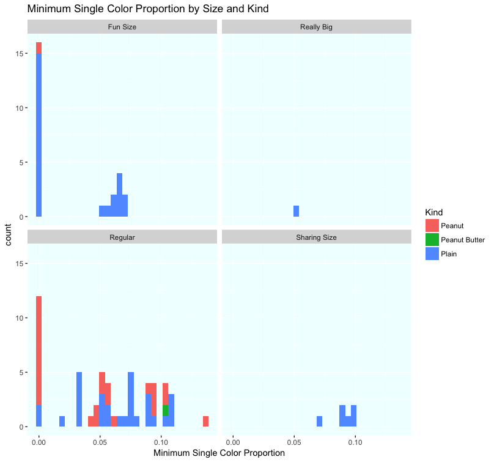

```{r setup, include=FALSE}
knitr::opts_chunk$set(echo = TRUE, warning=FALSE)
```

# Introduction

## M&Ms are colorful, fun and make for great data

I bet when you open a bag of M&Ms, you look at a few of them in your hand, admire the pretty color variation that exists, and just **eat them**. Yes, I used to do that, too. But in March, 2014, I spilled bag of M&Ms onto my desk and noticed something odd. I used a tool from my days as a Six Sigma Black Belt and created a Pareto Chart, and snapped this picture:


```{r, echo=FALSE}
```


Wait a minute! Only one brown? Why aren't they more even?

To make a long story short, I posted this on Facebook, and started routinely making "M&M Pareto Charts" and posting them to an album. A friend joined in and posted ones with Peanut M&Ms. As of today, we have logged ````r nrow(read.csv("M&M Pareto Counts.csv"))```` bags of M&Ms in this manner.

And recently, I compiled the posts into a data set. 

## M&Ms and the questions I might ask about colors

This story is about data, how to manipulate it and analyze it with data visualization tools, and in so doing explore many aspects of the colors of M&Ms! It is my hope that in reading this document, you will find:

* An amusing story about candy
* An example of inquiry into a data set
* Various examples of using graphs, with code, to examine the data

But back to the candy!

I became fascinated by what I was seeing because I saw so much variation. I mean, the naive person might just assume that every bag had (roughly) the same amount of each color. You could imagine a manufacturing process that did that, right? But could you imagine a manufacturing process that wasn't predictable in terms of the distribution of colors? That's what I was seeing!

As I looked at these pictures, I came to be curious about a number of things:

* how often is there only one of one color?
* how often does a bag have only five of the six colors?
* does blue really dominate the counts, as it seems to?
* how does the color distribution differ by size of bag?
    + are smaller bags more variable? 
    + are smaller bags more likely to have missing colors?
* do Peanut and Plain M&Ms have similar color distributions?

## Why Pareto Charts of M&Ms

Arranging the M&Ms as a Pareto chart* was natural to me because it is a typical way to summarize data of that sort. In my training as a Six Sigma Black Belt, I learned about these charts early on. But also:

1. The charts are pretty!
2. The category is its own label!

<span style="color:#156803">[*One might argue that these are not, technically, Pareto Charts, owing to the missing cumulative frequency line oft found on them. They may be simply termed as a "decreasing frequency bar chart". But I'll call them Pareto Charts here.]</span>

Point #2 above, is easy to demonstrate. Let's look at how we might chart a bag of M&Ms using R:

```{r}
# load some libraries I will use
library(tidyverse)
library(ggplot2)
library(forcats)
library(dplyr)
library(tidyr)

# establish a list of M&Ms
colorsm <- c("Blue","Blue","Blue","Blue","Orange","Orange","Orange","Orange","Red","Red","Red","Brown","Brown","Yellow","Yellow","Green")
# make the list into a data frame, where the value of each item is 1
dfcase<-data.frame(colorsm)
dfcase$vals <- 1
# plot the M&Ms with dotplot
ggplot(dfcase, aes(fct_infreq(colorsm)))+
  geom_dotplot(color=colorsm, fill=colorsm) +
  xlab(NULL) + ylab(NULL) +
  theme(panel.background = element_rect(fill="antiquewhite2")) +
  ggtitle("Dot Plot Single Bag Visualization")

```


This *Dot Plot* is not very satisfying. Notice how each column is labeled?  Maybe we can adjust the sizes of the circles and decrease the gaps, but that might be a lot of work. We can, in fact, remove those labels, as I will show in the next kind of chart of the same data:


```{r}
# same chart as a bar chart.
dfcase %>% 
  group_by(colorsm) %>% 
  summarize(counts=sum(vals)) %>% 
  mutate(colorsm = as.character(colorsm)) %>%
  arrange(desc(counts)) %>%
  ggplot(aes(fct_inorder(colorsm),counts)) + 
  #fine tune the colors
  geom_col(fill=c("mediumblue","orange3","red4","chocolate4","yellow3","green3")) +
  theme(panel.background = element_rect(fill="antiquewhite2")) +
  ggtitle("Bar Plot Single Bag Visualization") +
  # Remove the label from the x-axis
  xlab(NULL) +
  # Remove the categories from the x-axis
  theme(axis.title.x=element_blank(),
        axis.text.x=element_blank(),
        axis.ticks.x=element_blank())

```


But really, this *Bar Chart* is just not as satisfying as the actual photo of the M&Ms:


## Preparing the data for analysis

### Tidy set, untidy set, pros and cons

When I tabulated the data, I created a single row for each bag.

```{r}
# import the data file
original_df <- read.csv("M&M Pareto Counts.csv")

# fix dates, make working df
df <- original_df 
df$Date <- as.Date(df$Date)

# display the first six bags
head(df)

```

##### Not Tidy

This is *not* a **Tidy** format for the data. Tidy would look like this:


```{r}
library(tidyr)
# tidy the data, first setting rownames to a column as sort of a Bag ID, then 
# gather, settting the "key" to be the colors, the "value" being the count of each color in a given bag
# preserve the bag number, the date, the notes, the kind of M&Ms and the submitter since they are all attributes of the bag, not the M&M color  

df_tidy <- df %>% tibble::rownames_to_column("BagNum") %>% 
    gather(key= MMColor, value = CountInBag, -BagNum, -Date, -Notes, -Kind, -Submitter) %>%
  arrange(BagNum)

# display the first bag 
head(df_tidy)

```


##### Since "Bag" is the unit of analysis ....

As I analyzed this data, however, I found that I wanted to know things about the **bags** more often than I wanted to find the attributes of the set as a whole, as if the bags weren't dumped all together.  For example, I wanted to add the **total number of M&Ms** in each bag as a data attribute of each bag:


```{r}
# add bag count, so you can determine sizing ranges
df$BagCount <- rowSums(df[4:9])
# show the results
head(df)
```

```{r echo=FALSE}
# add in the BagCount to the tidy version so that later, we can use it
df_tidy <- df %>% tibble::rownames_to_column("BagNum") %>% 
    gather(key= MMColor, value = CountInBag, -BagNum, -Date, -Notes, -Kind, -Submitter, -BagCount) %>%
  arrange(BagNum)
```


##### Proportion....

Or, if I want to calculate what the **proportion** of each color is within each bag:


```{r}
# proportion of each color within bag
df$yellowp <- df$Yellow/df$BagCount
df$bluep <- df$Blue/df$BagCount
df$greenp <- df$Green/df$BagCount
df$brownp <- df$Brown/df$BagCount
df$orange <- df$Orange/df$BagCount
df$redp <- df$Red/df$BagCount

# show the results
head(df)
```


##### Tidy comment:

So, what I'm trying to say about Tidy Data is that it *depends upon what you are analyzing*. If you want to know characteristics of the *unit that the data is already summarized to*, you should keep it that way until you reach a case where you need to look at the data set as a whole.

Now, let's get to analyzing this data!

# Data Analysis

## Bag Sizes

One thing that is clearly missing from the data collection is the **Bag Size.** 

<span style="color:#156803">*M&Ms come in different sizes. There's a pretty typical size (which I call **Regular**), and there's the size you most often see around Halloween (a small bag callled **Fun Size** -- I like to joke that it would be more fun if it were bigger).*</span>

Not recorded? Well, this is a job for data visualization! Let's plot the sizes in our data set!

Since this analysis is about **bags**, we'll use the non-Tidy data set (df).


```{r}
# Do as histogram - shows a first glance
ggplot(df, aes(x=BagCount)) +
  geom_histogram(bins=20) +
  theme(panel.background = element_rect(fill="azure")) +
  ggtitle("Histogram: Count of M&Ms in Bags") +
  xlab("Count of M&Ms in a bag")
```

This gives us a pretty good first glance at the counts of M&Ms in the bags in our data set. We see there are at least four sizes. Let's also start to look at the different kinds of M&Ms in our data set, using color to view the Kind.

```{r}
# Switch to Bar Chart so there is no "binning", and use color 
ggplot(df, aes(BagCount))+
  geom_bar(aes(fill=Kind)) +
  scale_fill_brewer(palette = "YlOrBr") +
  theme(panel.background = element_rect(fill="azure")) +
  ggtitle("Bar Chart: Count of M&Ms in Bags, by Kind") +
  xlab("Count of M&Ms in a bag")

```


This is the same range as the histogram, and we can quickly see that the *Peanut* and *Peanut Butter* M&M bags only appear in the lowest range. We also see that there is only 1 bag that's Really Big (the line past 150)

Let's play with the limits to "zoom in" on a few ranges.


```{r}
# Zoom in on Plain:Regular and Sharing Size
ggplot(df, aes(BagCount))+
  geom_bar(aes(fill=Kind)) +
  xlim(45,110) +
  theme(panel.background = element_rect(fill="azure")) +
  ggtitle("Bar Chart: Count of M&Ms in Bags, Zoom in on 45 to 110") +
  xlab("Count of M&Ms in a bag")

```

The above shows us that there's a reasonable size grouping for Plain M&Ms for *Regular* and *Sharing Size*.


```{r}
#explore that outlier on the low side of Plain:Regular
ggplot(df, aes(BagCount))+
  geom_bar(aes(fill=Kind)) +
  scale_fill_brewer(palette = "YlOrBr") +
  xlim(15,45) +
  theme(panel.background = element_rect(fill="azure")) +
  ggtitle("Bar Chart: Count of M&Ms in Bags, Zoom in on 15 to 45") +
  xlab("Count of M&Ms in a bag")
```

This one shows that the lower end of the distribution has representatives of all three kinds, but is distinct from the lower-end of the *Regular* size.


```{r}
# zoom in on the small count to find Peanut:Regular and FunSize: Plain
ggplot(df, aes(BagCount))+
  geom_bar(aes(fill=Kind)) +
  scale_fill_brewer(palette = "YlOrBr") +
  xlim(0,30) +
  theme(panel.background = element_rect(fill="azure"))  +
  ggtitle("Bar Chart: Count of M&Ms in Bags, Zoom in on 0 to 30") +
  xlab("Count of M&Ms in a bag")
```

Now we can more clearly see the ranges for the Plain *Fun Size* and the Peanut *Regular*. And the one bag of Peanut Butter. It is worth noting: Peanut M&Ms are bigger, and hence there are fewer in them for a common size bag. There are lots of sources that explain that most candies are sold in weight-groupings.

If we separate them out, we can better define the size-ranges:

```{r}
# facet wrap to look at that range seperately
ggplot(df, aes(BagCount))+
  geom_histogram() +
  xlim(0,30) + 
  facet_wrap(~Kind) +
  theme(panel.background = element_rect(fill="azure"))  +
  ggtitle("Faceted Bar Chart: Count of M&Ms in Bags, Zoom in 0 to 30") +
  xlab("Count of M&Ms in a bag")

```


But there is that one bag of Peanut which seems to have a lot fewer: 


```{r}
# testing Peanut sizes
df %>% filter (Kind == "Peanut") %>%
  ggplot(aes(BagCount)) +
  geom_histogram() +
  theme(panel.background = element_rect(fill="cornsilk"))  +
  ggtitle("Bar Chart: Count of M&Ms in Peanut Bags") +
  xlab("Count of M&Ms in a bag")
```

Yes, that Peanut Bag, the really small one, is the Peanut *Fun Size*. I wish I had more of them in my data set!

<span style="color:#156803">[Formatting note: Have you noticed at this point that the background color on these charts is changing? There's a reason! The light blue ("azure") is the general background, when **Kind** of M&M is various. The light tan color ("antiquewhite2") represents the **Plain** M&Ms, because those M&M bags are brown, and the light yellow ("cornsilk") is for the yellow-bagged, **Peanut** M&Ms!]</span>


### Assigning Bag Size

Now, we want to put into the data-set the size-labels that we didn't track in the data.

(Follow the comments in the code to see how I'm doing that.)

```{r}
# Peanut sizes
# fun size is less than 10 -- there was only one in the data set
# set break point between the ranges observed, essentially the max of one size averages to the min of the next size up
pfun <- (10+15)/2
# regular is 15-25

# peanut butter bag is regular sized

# Plain sizes
# set break point between the ranges observed
# 10-20 is fun size
plfun <- (35+20)/2
# 35-75 is regular
plreg <- (90+75)/2
# 90-115 is big
plrb <- (150+115)/2
# >150 is really big

## set bag size factor

# initialize bag size
df$BagSize <- "NotSet"

# assign bag size factor, using a for-loop with a series of if-else constructs
# (This was a painstaking process and there may be better code approaches to this)
for (i in 1:nrow(df)) {
  # We have two sizes of Peanut so far, so identify Fun Size and class the rest as Regular
  if (df[i, "Kind"] == "Peanut"){
    if (df[i, "BagCount"] > pfun) {
      df[i, "BagSize"] <- "Regular"
    } else df[i, "BagSize"] <- "Fun Size"
  # We have four sizes of Plain so far, so knock them down from smallest to largest
        } else if (df[i, "Kind"] == "Plain"){
      if (df[i, "BagCount"] < plfun) {
        df[i, "BagSize"] <- "Fun Size"
      } else if (df[i,"BagCount"] < plreg) {
        df[i, "BagSize"] <- "Regular"
      } else if (df[i, "BagCount"] < plrb) {
        df[i, "BagSize"]  <- "Sharing Size"
      } else  df[i, "BagSize"] <- "Really Big"
  # if not Peanut, and not Plain, at present, with only one Peanut Butter, it's a Regular
    } else df[i, "BagSize"] <- "Regular"
}
```

Now, we have a Bag-Size attached to the data set.

```{r}
head(df)
```

## Color Analysis: Maximimums and Minimums

Let's get back to the questions I raised up front and start to explore the color distributions in the bags of M&Ms, shall we?

First, Maximum and Minimums in a bag. We need to extend the data set again by assigning the Maximum and Minimum proportions for each Bag.

```{r}
# biggest proportion and smallest proportion in each bag (columns 13 to 18)
df[, "maxp"] <- apply(df[, 13:18], 1, max)
df[, "minp"] <- apply(df[, 13:18], 1, min)

# take a look
head(df)
```

And now, let's make some graphs to see about the Max and Min.

The maximum proportion tells us the proportion that the most numerous color represents in a given bag. If, say, 40% of the bag is Yellow M&Ms, that might be the max proportion for that bag (40%). It tells us about concentration in a given bag versus more even distribution.

```{r, eval=FALSE}
# Max Analysis
# plot Kind and BagSize
ggplot(df, aes(maxp)) +
  geom_histogram(aes(fill=Kind)) +
  facet_wrap(~BagSize) +
  theme(panel.background = element_rect(fill="azure")) +
  ggtitle("Maximum Single Color Proportion by Size and Kind") +
  xlab("Maximum Single Color Proportion")

df %>% filter(Kind=="Plain") %>%
  ggplot(aes(maxp)) +
  geom_histogram() +
  facet_wrap(~BagSize) +
  theme(panel.background = element_rect(fill="antiquewhite2")) +
  ggtitle("Maximum Single Color Proportion by Size, Plain") +
  xlab("Maximum Single Color Proportion")

df %>% filter(Kind=="Peanut") %>%
  ggplot(aes(maxp)) +
  geom_histogram() +
  facet_wrap(~BagSize) +
  theme(panel.background = element_rect(fill="cornsilk")) +
  ggtitle("Maximum Single Color Proportion by Size, Peanut") +
  xlab("Maximum Single Color Proportion")

```


So that starts to tell us that there's a pretty wide range. The maximum color proportion seems to vary from as little as 20% to as much as 55%! It's also the case that for the smaller bags, that variability is greater (Fun Size, Plain, has that wide range), where as the bigger bags have smaller top ends (Regular, about 40%, Sharing Size, less than 30%). That seems to suggest that the bigger the bag, the less likely it is to have a large proportion of one color.

Now, we look at the minimum proportions.


```{r, eval=FALSE}
# # Min Analysis
# # plot kind and BagSize
ggplot(df, aes(minp)) +
  geom_histogram(aes(fill=Kind)) +
  facet_wrap(~BagSize) +
  theme(panel.background = element_rect(fill="azure")) +
  ggtitle("Minimum Single Color Proportion by Size and Kind") +
  xlab("Minimum Single Color Proportion")


df %>% filter(Kind=="Plain") %>%
  ggplot(aes(minp)) +
  geom_histogram() +
  facet_wrap(~BagSize) +
  theme(panel.background = element_rect(fill="antiquewhite2")) +
  ggtitle("Minimum Single Color Proportion by Size, Plain") +
  xlab("Minimum Single Color Proportion")

df %>% filter(Kind=="Peanut") %>%
  ggplot(aes(minp)) +
  geom_histogram() +
  facet_wrap(~BagSize) +
  theme(panel.background = element_rect(fill="cornsilk")) +
  ggtitle("Minimum Single Color Proportion by Size, Peanut") +
  xlab("Minimum Single Color Proportion")
```




This looks a little more odd. For example, *Plain:Fun Size*: It seems like a lot of the bags have missing colors (look at the tall bar at 0.00). This is also the case for *Regular:Peanut*, which we saw, earlier, has about the same number of M&Ms as a Plain:Fun Size bag does.

It's also the case that, though there is a some variation, it is not nearly as wide as the maximum. The minimums range from 0% to a bit of 10%.

## Color Analysis: Missing Colors

M&Ms come in six colors, as we saw in the pictures and graphs at the beginning. How often do we see bags that have fewer than six colors?

For that, we stick with the un-tidy data set. We're still talking about **bags**, not the whole set. We'll do some data manipulation first.

```{r}
# count the zeroes (missing colors) (this code summarizes it, but I want to add to each row)
foo <- colnames(df[,13:18])
count00 <- sapply(foo,FUN=function(x,df){sum(df[,x]==0, ra.rm=TRUE)},df)

# initialize a column
df$zeroes <- 0
# assign 1 to any row that has a zero count
for (i in 1:nrow(df)) {
  if (df[i,"minp"] == 0) {
    df[i,"zeroes"] <- 1
  } 
}
# take a look, now there is a column to identify if the bag has a missing color in it
head(df)
```


Then we can start to explore the data visually:


```{r}
# graph it
# sumamrize
dfzero <- df %>%
  group_by(Kind, BagSize) %>%
  summarize(bagswithmissingp = mean(zeroes), bagswithmissing = sum(zeroes), countofbags = n())

#order BasSize, which is ordinal
dfzero$BagSize <- factor(dfzero$BagSize, levels = c("Fun Size", "Regular", "Sharing Size", "Really Big"))

# filter out the ones with low bag counts
dfzero <- dfzero %>% filter(countofbags > 3)

# combine tags so we can look at Plain:Fun Size as a single characteristic
dfzero$KindSize <- c(paste0(dfzero$Kind,":",dfzero$BagSize))
```
```{r,eval=FALSE}
# graph
ggplot(dfzero, aes(x=reorder(KindSize,-bagswithmissingp), y=bagswithmissingp)) +
  geom_bar(stat="identity")+
  theme(panel.background = element_rect(fill="azure")) +
  annotate("text", x=3, y=0.06, label=c(paste0(as.character(100*round(dfzero[3,3],digits=3)),"%"))) +
  ggtitle("Proportion of Bags with a Missing Color, by Kind and Size") +
  xlab("Kind and Size of Bag") +
  ylab("Proportion of Bags with Missing Color")
```


I find this very interesting! The smallest bags, *Plain:Fun Size*, have the highest frequency of missing a color. While I don't have a lot of *Plain:Sharing Size* in the data set, there are none with missing colors. So the larger the count of M&Ms in the bag, the lower the chance of a missing color (and vice versa?). Here's a great opportunity to see if a Scatterplot helps.

```{r, eval=FALSE}
# scatter plot that!
ggplot(df, aes(x=BagCount, y=minp)) +
  geom_point(alpha=.3) +
  annotate("text", x=25, y=.06, label="odd curve")
```


Well.... not so much. I mean, there is this really odd curve where the smaller the count in a set of bags, the higher the minimum proportion is. But mostly, the problem is that it doesn't show us much more than the bar graph did. But that was a fun example of data exploration, no?

## Color Analysis: The lonely, Brown M&M

Remember that bag of M&Ms that set me down the path of collecting this data? At last, lets check the data set to see how often that happens!

We can take a similar approach to what we did with the zeros in terms of the data:

```{r}
# count the solo counts (one only) 
foo2 <- colnames(df[,4:9])
count01 <- sapply(foo2,FUN=function(x,df){sum(df[,x]==1, ra.rm=TRUE)},df)
# initialize a column
df$ones <- 0
# assign 1 to any row that has a single count
# for loop within a for loop, iterating for every color-column
for (j in 4:9) {
  for (i in 1:nrow(df)) {
    if (df[i,j] == 1) {
      df[i,"ones"] <- 1
    } 
  }
}
# take a look to see the new column
head(df)
```

And again, we can explore it visually.


```{r}
# graph it
# sumamrize
dfone <- df %>%
  group_by(Kind, BagSize) %>%
  summarize(bagswithsinglep = mean(ones), bagswithsingle = sum(ones), countofbags = n())

#order BasSize, which is ordinal
dfone$BagSize <- factor(dfone$BagSize, levels = c("Fun Size", "Regular", "Sharing Size", "Really Big"))

# filter out the ones with low bag counts
dfone <- dfone %>% filter(countofbags > 3)

# combine tags
dfone$KindSize <- c(paste0(dfone$Kind,":",dfone$BagSize))

# graph
ggplot(dfone, aes(x=reorder(KindSize,-bagswithsinglep), y=bagswithsinglep)) +
  geom_bar(stat="identity")+
  theme(panel.background = element_rect(fill="azure")) +
  annotate("text", x=3, y=0.06, label=c(paste0(as.character(100*round(dfone[3,3],digits=3)),"%"))) +
  ggtitle("Proportion of Bags with a Single M&M of a Color, by Kind and Size") +
  xlab("Kind and Size of Bag") +
  ylab("Proportion of Bags with Single M&M of a Color")
```

Well! Guess what? That bag, that bag with the lonely, brown M&M, was the only *Plain:Regular* bag in the data set that had a an M&M color with just one in the bag. And that's out of ````r df %>% filter(Kind=="Plain") %>% filter(BagSize=="Regular") %>% nrow() ```` bags!

This is what got me so curious, and for me, the next step is to determine the probability of this happening from a pure probability-theory perspective. But that's for another time.


## Color Analysis: Trends on the whole set

Now is the time I start to use the tidy data set, since I want to look at the data set as a whole, and Bags don't matter as much.

Let's make a *Bar Chart* using **geom_col** to take an overview:

```{r}
# Overall Proportion of Colors
df_tidy %>% group_by(MMColor) %>% summarize(count = sum(CountInBag)) %>% arrange(desc(count)) %>%
  ggplot(aes(fct_inorder(MMColor),count)) + 
  geom_col(fill=c("mediumblue","orange3","green3","yellow3","chocolate4","red4")) +
  ggtitle("Color Totals across all Bags in Sample") +
  xlab(NULL) +
  theme(panel.background = element_rect(fill="azure"))
```


My general impression that I was seeing a lot of Blue was not that far off. Also, we see a lot of Orange and Yellow, but considerably less of the three other colors.


Another way to look at it is by the frequency we see each color in a given bag:

```{r}
# color distribution of the data set, trimming out the Really Big Bag
ggplot(df_tidy, aes(CountInBag/BagCount)) + 
  geom_histogram(aes(y=..density..)) +
  geom_density(color="lightgreen") + 
  facet_wrap(~MMColor) +
  ggtitle("Frequency of Proportion of a Color in a Bag, by Color") +
  xlab("Proportion of a Color in a Bag") +
  ylab("Proportion Frequency") +
  theme(panel.background = element_rect(fill="azure"),
        panel.grid.major = element_line(color="grey90"),
        panel.grid.minor = element_line(color="grey95")) 
```

By faceting on Color, and overlaying a Density curve we also see how Red, Brown and Yellow often have smaller numbers within a bag (given how much tighter the distributions are). But we also can see that Yellow, Orange and Blue have flatter, more even distributions. I think, a naive viewer of M&Ms would guess that all colors would have similar distributions.

Hey... Isn't this a perfect time for a Ridgeline plot? That's what I thought when I was trying to compare the distributions of the six colors via the Facet Wrap.

```{r}
#ridgeline
ggplot(df_tidy, aes(x= CountInBag/BagCount, y=reorder(MMColor,-CountInBag/BagCount, median)))+
  ggridges::geom_density_ridges(fill="lightgreen", alpha=.5) +
  ggtitle("Density Curve of Proportion of a Color in a Bag, by Color") +
  xlab("Proportion of a Color in a Bag") +
  ylab(NULL) +
  theme(panel.background = element_rect(fill="azure"))
```

Much better! It shows how much sharper the modes are for the three least numerous colors, while the more numerous ones have flatter and wider distributions. It seems that Blue, Orange and Green all had more bags with high proportions.

And still....

This may be a good time for a statistical test. Is the mean for Blue different than the mean for the least numerous, Red? Is Blue different than the mean for the second most numerous, Orange?

```{r}
#test Plain, Blue vs. Red and then Blue vs. Orange
xblue <- df_tidy %>% filter(Kind=="Plain",MMColor=="Blue")
yred <-  df_tidy %>% filter(Kind=="Plain",MMColor=="Red")
yorange <-  df_tidy %>% filter(Kind=="Plain",MMColor=="Orange")
t.test(xblue$CountInBag , yred$CountInBag)
t.test(xblue$CountInBag , yorange$CountInBag)


#test Peanut, Blue vs. Red and then Blue vs. Orange
xblue <- df_tidy %>% filter(Kind=="Peanut",MMColor=="Blue")
yred <-  df_tidy %>% filter(Kind=="Peanut",MMColor=="Red")
yorange <-  df_tidy %>% filter(Kind=="Peanut",MMColor=="Orange")
t.test(xblue$CountInBag , yred$CountInBag)
t.test(xblue$CountInBag , yorange$CountInBag)

#test Blue vs. Orange across whole sample
xblue <- df_tidy %>% filter(MMColor=="Blue")
yorange <-  df_tidy %>% filter(MMColor=="Orange")
t.test(xblue$CountInBag , yorange$CountInBag)

```

Blue is most certainly present more frequently than Red. Even if you divide the sample between Peanut and Plain, the tests come out clearly. However, Blue is not statistically different from Orange. This tells us that while counts of all colors are not the same, there isn't really a significant difference in the most numerous.

### Scatterplot Matrix?

Perhaps we might like to know if there is a relationship between the colors in the bags. A good tool for that is the Scatterplot Matrix. For the "splom", I really prefer **ggpairs**. It gives a lot of information in one plot, including statistics of correlation, which I appreciate.

```{r}
# plotting scatterplots of each color against the other
library(GGally)
df %>% filter(Kind != "Peanut Butter") %>%
  ggpairs(columns = 4:9,
          mapping=aes(color = Kind),
          title="Scatterplot Matrix of Color Count in Bags")
```

I love this because it shows the distributions, and it is easy it is to see the difference between the counts in the Regular Size Peanut Bags (which have about 20 M&Ms) and the Plain ones (which have about 50 M&Ms). And you can see how much wider the distribution is for each color in the more numerous, Plain Regular bags.

You can also read off this chart that there are correlations between each color in the Plain bags, the lowest being Brown to Red (the least numerous), and the highest being Green to Red. 

The scatter plots themselves don't show a whole lot, except all the Plain bags have some relationship, and the Peanut bags don't. If you think this through, it makes sense. 20 M&Ms divided by 5 or 6 colors is an average of 3 or 4 per bag (for Peanut), while for the 50 Plain M&Ms, it's about 10 per color. There's more room for variation in the larger-count bags, no?


**However** 
What if we factor out the size of the bag and make use of the proportion columns?
```{r}
df %>% filter(Kind != "Peanut Butter") %>%
  ggpairs(columns = 12:17,
          mapping=aes(color = Kind),
          title="Scatterplot Matrix of Color Proportion in Bags")
```

Looks like a whole lot of noise? Doesn't it? So, it may be safer to conclude that there are really no strong relationships between the colors in a bag, which actually makes a lot more sense.


### Parallel Coordinate Graph?

```{r}
# plot of proportions of each color in each bag, parallel coordinate graphs
df %>% filter(Kind != "Peanut Butter") %>%
  ggparcoord(columns = 12:17, scale = "globalminmax",groupColumn="Kind", 
             title="Count of M&Ms by Color in a Bag", 
             order = c(13,16,14,12,15,17)) +
      scale_color_manual(values = c("yellow","brown"))
```

I ordered them by decreasing frequency in the total data set on purpose. And, well, sometimes, a graph doesn't really show you much.

### Mosaic

So as not to end on a weak note, I thought I'd throw in a simple Mosaic.

```{r}
library(grid)
library(vcd)

df_m<- df_tidy %>%
  group_by(MMColor,Kind) %>% 
  summarize(Freq=sum(CountInBag))
# Meh
mosaic(MMColor~Kind, df_m,direction= c("v","h"),labeling = labeling_border(rot_labels = c(20, 45)))
```

You'll note my comment of "Meh" in the comments, but this graph does show us the slight variation of colors across the data set. I would have thought that the predominance of Blue I was finding would not be found in the Peanut bags (after all, I was responsible for the Plain, my friend, the Peanut). But here it shows that the Blue was similarly numerous in the Peanut bags, too. I find that very interesting!


## Conclusion

Let's review my original questions and how they turned out:

* how often is there only one of one color?

    <span style="color:#8C0ACA">*For a Regular-sized, Plain bag of M&Ms, it's pretty unusual! However, for bags with smaller counts, it can happen pretty regularly. I've yet to run the probability calculations to see if the rate is higher or lower than it "should be"* </span>

* how often does a bag have only five of the six colors?

    <span style="color:#8C0ACA">*This is also pretty unusual for Regular, Plain M&Ms, but again, with smaller-count bags (Fun Size, or Peanut Regular Size), it can happen more often*</span>

* does blue really dominate the counts, as it seems to?

    <span style="color:#8C0ACA">*Blue did show up more frequently than any other color, and it was significantly more than the least frequent color (Red). But it was not dominant overall.*</span>

* how does the color distribution differ by size of bag?
    + are smaller bags more variable? 
     
      <span style="color:#8C0ACA">*In the sense that smaller bags are more likely to have missing colors, yes. But in the sense that a larger-count bag can have a lot more of one color, no.* </span>
    
    + are smaller bags more likely to have missing colors?
    
      <span style="color:#8C0ACA">*Yes!*</span>
    
* do Peanut and Plain M&Ms have similar color distributions?

    <span style="color:#8C0ACA">*Yes, and that was one of the more surprising findings (the Mosaic chart)*</span>


I hope you had some fun thinking about the delicious candy and the things we could do with data visualization in analyzing the colors! I know this was fun for me.

Last point: **more data?**  Would you consider adding to the data set? All you have to do is:

* Open a bag of M&Ms
* Sort them by color
* Take a picture
* Upload to a public image hosting site
* Summarize the bag information at this [Google Sheet](https://docs.google.com/spreadsheets/d/159QVCZBDgJ5ehtGBU0gGQOD-oQnyEh-rVSbsaCsi-xQ/edit#gid=0)

When I get a lot more data, I can update this analysis and see if my relatively small sample holds true to more bags. I especially need a diversity of bag sizes across Plain, Peanut and Peanut Butter!
